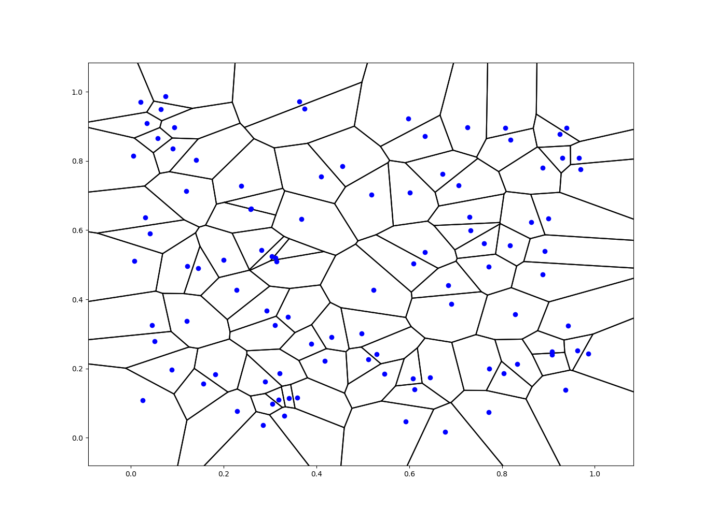
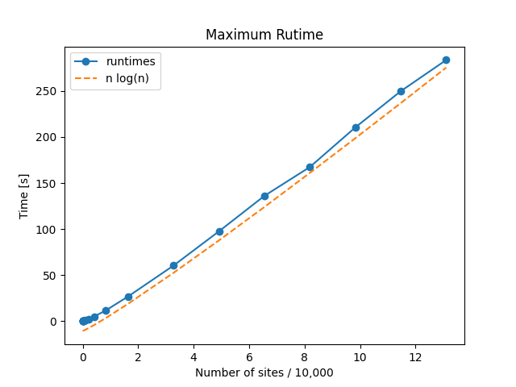

# Voronoi Diagrams

This is a tool for generating Voronoi diagrams from a set of sites.

# Algorithms

Most algorithms and data structures are implemented as discussed in
Computational Geometry: Algorithms and Applications by de Berg et
al. They include:

* Fortune's algorithm - The sweepline algorithm for generating Voronoi
  diagrams, involves queuing sites and vertices for insertion.

* Doubly connected edge list - A data structure for joining vertices
  and edges in a mesh.

* Balanced binary trees - AVL trees for tracking sites and edges as
  needed for Fortune's algorithm.

Additionally, the code includes boundary volume hierarchy (BVH) trees
in the doubly connected edge lists for efficient searching of nearby
vertices. This was implemented to prevent addition of degenerate
Voronoi vertices while maintaining (on average) time complexity of O(n
log n).

# Examples

This is a Voronoi diagram of 100 points. It can be replicated
by running the following from the root directory.

```
python examples/ex_random.py 0 1 0 1 100
```

<p align="center">
   
</p>

# Complexity

The following plot shows tests of the time complexity of the
algorithm. It runs the experiment on a random set of sites, with the
number of sites scaling up to roughly 120,000 sites. Experiments were
run 20 times for each number of sites. The maximum runtimes are shown
in the image and they scale with roughly O(n log n) time complexity,
as expected.

<p align="center">
   
</p>

# Installation

Dependencies can be installed with:

```
python -m pip install -r requirements.txt
```

Afterwards it is worth running tests with pytest along with examples.
